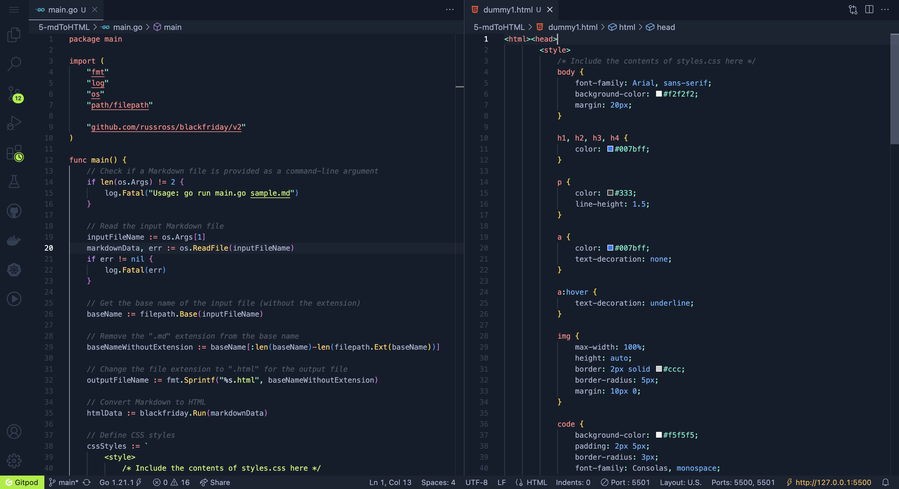

# mdToHTML


A command-line tool for converting Markdown files to HTML.

### Features

- **Markdown to HTML Conversion:** Convert Markdown files to HTML effortlessly.


### Demo


```bash
gitpod /workspace/gobox/5-mdToHTML (main) $ go build -o mdtohtml
gitpod /workspace/gobox/5-mdToHTML (main) $ ./mdtohtml dummy1.md 
2023/10/05 21:21:44 Markdown converted to HTML and saved as dummy1.html
```


