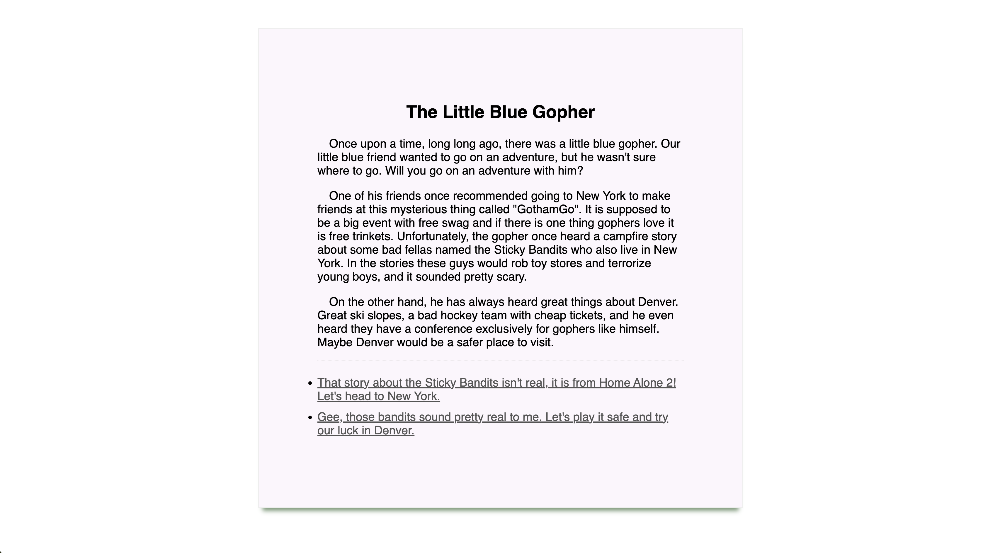

### Create Your Own Adventure

- [Here](https://github.com/gophercises/cyoa/blob/solution/README.md) is the challenge

- This is how the output looks like
    ```bash
    gitpod /workspace/gobox/cyoa (main) $ go run cmd/cyoaweb/main.go 
    Using the story in gopher.json.
    Starting the server at: 3000
    ```

- Once the webpage loads on the localhost, the path `/story` will be serves this page.
- All the links work fine and load another story based on the json file.

    
